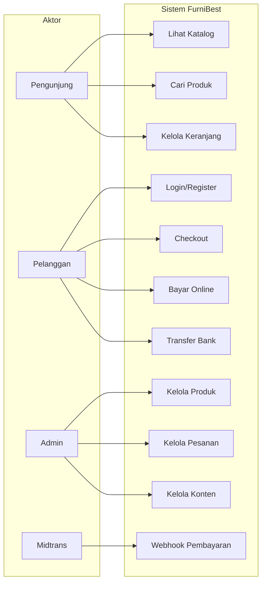
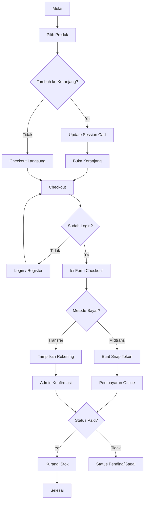
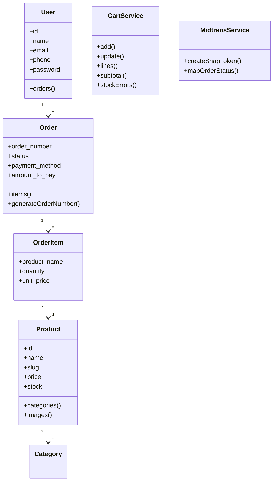

# LAPORAN PROYEK AKHIR E-COMMERCE

## Aplikasi E-Commerce Furniture **FurniBest**
### (Cacam Furniture Jepara)

---

| | |
|---|---|
| **Mata Kuliah** | E-Commerce / Proyek Akhir |
| **Dosen Pengampu** | Teguh Tamrin, M.Kom |
| **Jenis Ujian** | Take Home |
| **Nama Mahasiswa** | *(isi nama Anda)* |
| **NIM** | *(isi NIM Anda)* |
| **Program Studi** | *(isi prodi Anda)* |
| **Tanggal** | Juli 2026 |

---

## DAFTAR ISI

1. [BAB I — Pendahuluan](#bab-i--pendahuluan)
2. [BAB II — Landasan Teori](#bab-ii--landasan-teori)
3. [BAB III — Analisis Bisnis](#bab-iii--analisis-bisnis)
4. [BAB IV — Implementasi Sistem](#bab-iv--implementasi-sistem)
5. [BAB V — Hasil dan Pembahasan](#bab-v--hasil-dan-pembahasan)
6. [BAB VI — Kesimpulan dan Saran](#bab-vi--kesimpulan-dan-saran)
7. [Lampiran](#lampiran)

---

# BAB I — PENDAHULAN

## 1.1 Latar Belakang

Perkembangan teknologi informasi dan internet telah mengubah cara masyarakat berbelanja. Konsumen kini lebih memilih bertransaksi secara daring karena kemudahan akses, ketersediaan informasi produk, serta fleksibilitas waktu pemesanan. Fenomena ini mendorong banyak pelaku usaha, termasuk industri furniture, untuk memanfaatkan platform e-commerce sebagai sarana pemasaran dan penjualan.

Industri furniture Jepara merupakan salah satu sentra kerajinan kayu terbesar di Indonesia yang memiliki potensi pasar luas, baik domestik maupun internasional. Namun, tidak sedikit UMKM furniture masih mengandalkan penjualan konvensional melalui showroom, media sosial, atau pesanan langsung. Pendekatan tersebut memiliki keterbatasan dalam hal jangkauan pasar, dokumentasi katalog produk, serta pengelolaan pesanan yang terstruktur.

Berdasarkan kondisi tersebut, penulis mengembangkan aplikasi e-commerce berbasis web bernama **FurniBest** — sebuah platform penjualan furniture online untuk **Cacam Furniture Jepara**. Aplikasi ini dibangun menggunakan framework **Laravel 8** dengan basis data **MySQL**, serta mengintegrasikan payment gateway **Midtrans** untuk mendukung transaksi digital. Sistem ini dirancang untuk memudahkan pelanggan dalam menelusuri katalog, melakukan pemesanan, dan memilih metode pembayaran, sekaligus menyediakan panel admin untuk pengelolaan produk, pesanan, dan konten website.

## 1.2 Rumusan Masalah

Berdasarkan latar belakang di atas, rumusan masalah dalam proyek ini adalah:

1. Bagaimana merancang dan membangun sistem e-commerce furniture yang dapat menampilkan katalog produk secara online?
2. Bagaimana mengimplementasikan algoritma pencarian produk pada sistem?
3. Bagaimana merancang alur pemesanan dan pembayaran yang mendukung transaksi online (Midtrans) maupun transfer bank manual?
4. Bagaimana menyediakan fitur admin untuk mengelola produk, pesanan, dan konten bisnis digital?

## 1.3 Tujuan

Tujuan dari proyek akhir e-commerce ini adalah:

1. Membangun aplikasi web e-commerce furniture **FurniBest** yang dapat diakses oleh pelanggan melalui browser.
2. Mengimplementasikan algoritma **sequential search** untuk pencarian produk berdasarkan nama.
3. Mengimplementasikan fitur **keranjang belanja berbasis session** dengan validasi stok.
4. Mengintegrasikan sistem pembayaran menggunakan **Midtrans** serta opsi **transfer bank manual**.
5. Menyediakan panel admin untuk pengelolaan katalog, pesanan, rekening bank, dan konten website.
6. Mendokumentasikan analisis bisnis digital, implementasi sistem, serta hasil pengujian sebagai laporan proyek akhir.

---

# BAB II — LANDASAN TEORI

## 2.1 E-Commerce

E-commerce (*electronic commerce*) adalah kegiatan jual beli barang atau jasa yang dilakukan melalui jaringan internet. Menurut Laudon & Traver, e-commerce mencakup proses bisnis mulai dari promosi produk, transaksi pembayaran, hingga layanan purna jual secara digital.

Komponen utama sistem e-commerce meliputi:

| Komponen | Penjelasan |
|---|---|
| **Frontend** | Antarmuka yang diakses pelanggan (katalog, keranjang, checkout) |
| **Backend** | Logika bisnis, pengelolaan data, dan keamanan sistem |
| **Database** | Penyimpanan data produk, pengguna, dan transaksi |
| **Payment Gateway** | Perantara pembayaran online (Midtrans, dll.) |

Aplikasi FurniBest termasuk dalam kategori **B2C (Business to Consumer)**, yaitu model bisnis di mana perusahaan menjual produk langsung kepada konsumen akhir melalui platform web.

## 2.2 Model Bisnis Digital

Model bisnis digital yang diterapkan pada FurniBest adalah **online retail** dengan pendekatan katalog produk dan pemesanan daring. Karakteristik model bisnis ini:

1. **Value Proposition** — Menyediakan furniture berkualitas dari Jepara dengan kemudahan pemesanan online, informasi bahan/warna, dan opsi pembayaran fleksibel (lunas atau DP).
2. **Customer Segments** — Pemilik rumah, kontraktor interior, dan konsumen yang mencari furniture custom maupun siap pakai.
3. **Channels** — Website e-commerce sebagai kanal utama penjualan.
4. **Revenue Streams** — Penjualan produk furniture melalui transaksi online dan transfer bank.
5. **Key Resources** — Katalog produk digital, sistem pemesanan, integrasi pembayaran, dan panel admin.
6. **Key Activities** — Pengelolaan produk, pemrosesan pesanan, konfirmasi pembayaran, dan pembaruan konten.

## 2.3 Algoritma yang Digunakan

Dalam sistem FurniBest, algoritma utama yang diterapkan secara spesifik untuk pengolahan data adalah **Sequential Search (Pencarian Berurutan)**.

### 2.3.1 Algoritma Sequential Search (Pencarian Berurutan)

Algoritma sequential search (*linear search*) adalah metode pencarian yang menelusuri setiap elemen data satu per satu secara berurutan mulai dari elemen pertama hingga ditemukan kecocokan dengan kata kunci. Kompleksitas waktu algoritma ini adalah **O(n)**, dengan *n* adalah jumlah produk dalam katalog.

**Kegunaan dalam sistem:** Mencari produk furniture berdasarkan nama yang diketikkan pengguna pada halaman katalog.

**Pseudocode:**

```
INPUT: daftar_produk[], keyword
OUTPUT: hasil[]

keyword_lower ← lowercase(keyword)
hasil ← array kosong

UNTUK SETIAP produk DALAM daftar_produk:
    JIKA substring(keyword_lower, lowercase(produk.nama)) = TRUE:
        tambahkan produk ke hasil
    AKHIR JIKA
AKHIR UNTUK

RETURN hasil
```

---

# BAB III — ANALISIS BISNIS

## 3.1 Target Pasar

Target pasar FurniBest meliputi:

| Segmen | Karakteristik |
|---|---|
| **Pemilik rumah** | Usia 25–55 tahun, ingin melengkapi atau merenovasi interior rumah |
| **Pasangan baru** | Membutuhkan furniture untuk hunian baru (sofa, lemari, meja makan) |
| **Kontraktor / desainer interior** | Memesan furniture dalam jumlah tertentu untuk proyek klien |
| **Konsumen regional** | Wilayah Jepara, Jawa Tengah, dan sekitarnya yang mengakses via internet |

## 3.2 Segmentasi Pelanggan

Segmentasi pelanggan berdasarkan perilaku dan kebutuhan:

1. **Pelanggan harga hemat** — Membandingkan produk, memanfaatkan promo, memilih DP 30%.
2. **Pelanggan premium** — Mencari furniture custom, memperhatikan bahan dan warna finishing.
3. **Pelanggan praktis** — Mengutamakan checkout cepat dan pembayaran online via Midtrans.
4. **Pelanggan tradisional** — Lebih nyaman transfer bank manual dan konfirmasi ke admin.

## 3.3 Strategi Promosi

Strategi promosi digital yang diterapkan dalam sistem:

| Strategi | Implementasi di FurniBest |
|---|---|
| **Homepage hero banner** | Banner utama dapat diubah admin (`/admin/branding`) |
| **Kartu promo** | Section promo di halaman beranda dengan gambar dan teks |
| **Produk unggulan** | Kategori khusus "Produk Unggulan" ditampilkan di beranda |
| **Katalog kategori** | Navigasi per kategori: Sofa, Almari, Buffet, Dipan, Meja Makan |
| **Halaman tentang & kontak** | Membangun kepercayaan melalui cerita brand, bahan, dan sampel warna |
| **Konsultasi produk** | Link dari halaman produk ke halaman kontak |

## 3.4 Metode Pembayaran

Sistem FurniBest mendukung dua metode pembayaran utama:

### A. Pembayaran Online — Midtrans

Mendukung berbagai channel:
- Kartu kredit/debit (3D Secure)
- Virtual Account (BCA, BNI, BRI, Permata, Mandiri)
- E-wallet (GoPay, ShopeePay, QRIS)
- Minimarket (Indomaret, Alfamart)
- Cicilan / online banking

### B. Transfer Bank Manual

- Admin mengelola daftar rekening bank di panel admin
- Pelanggan memilih rekening tujuan saat checkout
- Pelanggan mengisi catatan transfer setelah melakukan pembayaran
- Admin mengonfirmasi pembayaran secara manual

### Skema Pembayaran

| Tipe | Keterangan |
|---|---|
| **Bayar Penuh** | Pelunasan 100% saat checkout |
| **DP 30% / 50%** | Pembayaran sebagian, sisa dibayar kemudian |

## 3.5 Alur Pemesanan

Alur pemesanan (*ordering workflow*) pada FurniBest:

```
[1] Pengunjung membuka website
         ↓
[2] Menelusuri katalog / mencari produk / filter kategori
         ↓
[3] Melihat detail produk
         ↓
[4] Menambahkan ke keranjang ATAU checkout langsung
         ↓
[5] Login / Register (wajib untuk checkout)
         ↓
[6] Mengisi form checkout (nama, telepon, alamat, catatan)
         ↓
[7] Memilih metode bayar (Midtrans / Transfer) & tipe (Penuh / DP)
         ↓
[8] Sistem membuat pesanan (status: pending)
         ↓
    ┌────────────────────┴────────────────────┐
    ↓                                         ↓
[9a] Transfer Bank                    [9b] Midtrans Snap
    - Tampilkan rekening                  - Popup pembayaran
    - Isi catatan transfer                - Webhook notifikasi
    - Admin konfirmasi                    - Status otomatis
    ↓                                         ↓
[10] Pembayaran dikonfirmasi (status: paid)
         ↓
[11] Stok produk dikurangi
         ↓
[12] Halaman selesai / riwayat pesanan
```

---

# BAB IV — IMPLEMENTASI SISTEM

## 4.1 Spesifikasi Teknologi

| Komponen | Teknologi |
|---|---|
| Bahasa pemrograman | PHP 8.x |
| Framework | Laravel 8.75 |
| Basis data | MySQL |
| Payment gateway | Midtrans PHP SDK 2.6 |
| Frontend CSS | Tailwind CSS (CDN) |
| Web server | Apache (XAMPP) / Laravel Artisan Serve |
| Arsitektur | MVC (Model-View-Controller) |
| Session | File-based session driver |

## 4.2 Struktur Database

### Tabel Utama

| Tabel | Fungsi |
|---|---|
| `users` | Data akun pelanggan |
| `categories` | Kategori produk (Sofa, Almari, dll.) |
| `products` | Data produk furniture |
| `category_product` | Relasi many-to-many produk ↔ kategori |
| `product_images` | Gambar tambahan produk |
| `orders` | Data pesanan |
| `order_items` | Detail item per pesanan |
| `bank_accounts` | Rekening untuk transfer manual |
| `brand_settings` | Logo website |
| `home_hero_settings` | Banner beranda |
| `home_promo_settings` | Konten promo beranda |
| `about_settings` | Konten halaman tentang |
| `materials` | Informasi bahan furniture |
| `color_samples` | Sampel warna finishing |

### Relasi Database (ERD)

```
users (1) ──────< orders (N)
orders (1) ──────< order_items (N)
orders (N) >────── bank_accounts (1)
order_items (N) >── products (1)
products (N) >────< categories (N)  [pivot: category_product]
products (1) ──────< product_images (N)
```

## 4.3 Tampilan Sistem

> **Catatan:** Sisipkan screenshot aktual dari aplikasi yang berjalan di `http://127.0.0.1:8000`

### 4.3.1 Halaman Pelanggan (Frontend)

| No | Halaman | URL | Deskripsi |
|---|---|---|---|
| 1 | Beranda | `/` | Hero banner, promo, produk unggulan, daftar kategori |
| 2 | Katalog Produk | `/produk` | Daftar produk dengan filter kategori & pencarian |
| 3 | Detail Produk | `/produk/{slug}` | Gambar, harga, stok, tombol keranjang & checkout |
| 4 | Keranjang | `/keranjang` | Daftar item, ubah jumlah, subtotal |
| 5 | Login | `/masuk` | Form masuk akun pelanggan |
| 6 | Register | `/daftar` | Form pendaftaran akun baru |
| 7 | Checkout | `/produk/{slug}/checkout` atau `/keranjang/checkout` | Form pemesanan & pilihan pembayaran |
| 8 | Pembayaran | `/pesanan/{no}/bayar` | Halaman Midtrans Snap / simulasi |
| 9 | Transfer | `/pesanan/{no}/transfer` | Instruksi transfer bank |
| 10 | Pesanan Saya | `/pesanan-saya` | Riwayat pesanan pelanggan |
| 11 | Tentang Kami | `/tentang-kami` | Cerita brand, bahan, sampel warna |
| 12 | Kontak | `/kontak` | Informasi kontak & form konsultasi |

**[Screenshot 1: Halaman Beranda]**

**[Screenshot 2: Halaman Katalog Produk]**

**[Screenshot 3: Halaman Detail Produk]**

**[Screenshot 4: Halaman Keranjang Belanja]**

**[Screenshot 5: Halaman Checkout]**

### 4.3.2 Halaman Admin (Backend)

| No | Halaman | URL | Deskripsi |
|---|---|---|---|
| 1 | Kelola Kategori | `/admin/categories` | CRUD kategori produk |
| 2 | Kelola Produk | `/admin/products` | CRUD produk + upload gambar |
| 3 | Kelola Pesanan | `/admin/orders` | Daftar & detail pesanan |
| 4 | Rekening Bank | `/admin/bank-accounts` | CRUD rekening transfer |
| 5 | Branding & Konten | `/admin/branding` | Logo, hero, promo, tentang |
| 6 | Bahan | `/admin/materials` | CRUD informasi bahan |
| 7 | Sampel Warna | `/admin/color-samples` | CRUD sampel warna |

**[Screenshot 6: Panel Admin — Kelola Produk]**

**[Screenshot 7: Panel Admin — Kelola Pesanan]**

## 4.4 Penjelasan Fitur

### 4.4.1 Fitur Pelanggan

| Fitur | Penjelasan |
|---|---|
| **Pencarian produk** | Mencari furniture berdasarkan nama menggunakan algoritma sequential search |
| **Filter kategori** | Menyaring produk berdasarkan kategori (Sofa, Almari, dll.) |
| **Keranjang belanja** | Menyimpan item sementara di session, validasi stok otomatis |
| **Checkout** | Form pemesanan dengan data pengiriman dan pilihan pembayaran |
| **Pembayaran Midtrans** | Integrasi Snap API untuk pembayaran online multi-channel |
| **Transfer manual** | Instruksi rekening bank + konfirmasi catatan transfer |
| **DP 30%/50%** | Opsi pembayaran sebagian untuk pesanan besar |
| **Riwayat pesanan** | Melihat status dan detail pesanan yang pernah dibuat |
| **Registrasi & login** | Autentikasi pelanggan untuk proses checkout |

### 4.4.2 Fitur Admin

| Fitur | Penjelasan |
|---|---|
| **Manajemen produk** | Tambah, edit, hapus produk beserta gambar dan kategori |
| **Manajemen kategori** | Kelola kategori dengan slug otomatis |
| **Manajemen pesanan** | Lihat daftar pesanan, filter status, konfirmasi transfer |
| **Manajemen rekening** | Atur rekening bank untuk pembayaran manual |
| **CMS konten** | Kelola logo, banner hero, promo, halaman tentang |
| **Manajemen bahan & warna** | Tampilkan informasi bahan dan sampel warna di halaman About |

## 4.5 Implementasi Algoritma

Algoritma yang diimplementasikan secara eksplisit dalam kode program adalah **Sequential Search** untuk menyaring produk berdasarkan kecocokan kata kunci pada nama produk.

### 4.5.1 Implementasi Kode Sequential Search
**File:** `app/Http/Controllers/PageController.php`

```php
// Ambil semua produk
$allProducts = Product::with(['categories', 'images'])->latest()->get();

// Sequential Search berdasarkan nama
if ($keyword !== '') {
    $keywordLower = mb_strtolower($keyword);
    $searchResult = collect();

    foreach ($allProducts as $product) {
        if (mb_strpos(mb_strtolower($product->name), $keywordLower) !== false) {
            $searchResult->push($product);
        }
    }

    $allProducts = $searchResult;
}
```

**Penjelasan:**
Sistem mengambil seluruh data produk dari database terlebih dahulu. Kemudian, sistem melakukan penelusuran secara linier (satu per satu) menggunakan perulangan `foreach`. Setiap nama produk diubah ke huruf kecil (*lowercase*) dan dibandingkan dengan kata kunci pencarian yang juga sudah diubah ke huruf kecil menggunakan fungsi `mb_strpos()` agar bersifat tidak sensitif terhadap huruf besar/kecil (*case-insensitive*). Produk yang mengandung kata kunci tersebut akan dimasukkan (*push*) ke dalam koleksi hasil pencarian (`$searchResult`), yang kemudian menggantikan koleksi produk awal untuk ditampilkan ke pengguna.

### 4.5.2 Analisis Kompleksitas Waktu

| Operasi | Deskripsi | Kompleksitas |
|---|---|---|
| Ambil data produk | Mengambil seluruh *n* produk dari database | O(n) |
| Penelusuran (Looping) | Menelusuri *n* produk secara berurutan | O(n) |
| Pencocokan String | Membandingkan nama produk dengan kata kunci | O(1) rata-rata |
| **Total Kompleksitas** | **Kompleksitas Terburuk (Worst Case)** | **O(n)** |

## 4.6 Diagram UML

### 4.6.1 Use Case Diagram



### 4.6.2 Activity Diagram — Alur Checkout



### 4.6.3 Class Diagram (Ringkas)



---

# BAB V — HASIL DAN PEMBAHASAN

## 5.1 Pengujian Sistem

Pengujian dilakukan secara manual (*black box testing*) pada lingkungan lokal:

- **OS:** Windows 10/11
- **Server:** Laravel Artisan Serve (`http://127.0.0.1:8000`)
- **Database:** MySQL via XAMPP
- **Browser:** Google Chrome / Microsoft Edge

### Tabel Pengujian Fitur Pelanggan

| No | Skenario Uji | Input | Hasil Diharapkan | Hasil Aktual | Status |
|---|---|---|---|---|---|
| 1 | Buka halaman beranda | Akses `/` | Tampil hero, promo, produk unggulan | Sesuai | ✅ |
| 2 | Lihat katalog produk | Akses `/produk` | Tampil daftar produk | Sesuai | ✅ |
| 3 | Cari produk "sofa" | `?cari=sofa` | Tampil produk bernama mengandung "sofa" | Sesuai | ✅ |
| 4 | Filter kategori | `?kategori=sofa` | Hanya produk kategori Sofa | Sesuai | ✅ |
| 5 | Lihat detail produk | Klik produk | Tampil gambar, harga, stok | Sesuai | ✅ |
| 6 | Tambah ke keranjang | Klik "Tambah ke Keranjang" | Item masuk keranjang, badge count bertambah | Sesuai | ✅ |
| 7 | Ubah jumlah keranjang | Set qty = 3 | Subtotal terupdate | Sesuai | ✅ |
| 8 | Checkout tanpa login | Klik checkout | Redirect ke halaman login | Sesuai | ✅ |
| 9 | Register akun baru | Isi form daftar | Akun terbuat, redirect | Sesuai | ✅ |
| 10 | Login | Email & password valid | Berhasil masuk | Sesuai | ✅ |
| 11 | Checkout produk | Isi form + pilih transfer | Pesanan terbuat, redirect ke halaman transfer | Sesuai | ✅ |
| 12 | Lihat pesanan saya | Akses `/pesanan-saya` | Tampil riwayat pesanan | Sesuai | ✅ |

### Tabel Pengujian Fitur Admin

| No | Skenario Uji | Input | Hasil Diharapkan | Hasil Aktual | Status |
|---|---|---|---|---|---|
| 1 | Tambah kategori | Nama: "Kursi" | Kategori tersimpan | Sesuai | ✅ |
| 2 | Tambah produk | Nama, harga, stok, gambar | Produk tersimpan dengan slug | Sesuai | ✅ |
| 3 | Edit produk | Ubah harga | Data terupdate | Sesuai | ✅ |
| 4 | Hapus produk | Klik hapus + konfirmasi | Produk terhapus | Sesuai | ✅ |
| 5 | Lihat daftar pesanan | Akses `/admin/orders` | Tampil semua pesanan | Sesuai | ✅ |
| 6 | Konfirmasi transfer | Klik konfirmasi pembayaran | Status → paid, stok berkurang | Sesuai | ✅ |
| 7 | Kelola rekening bank | Tambah rekening BCA | Rekening tampil di checkout | Sesuai | ✅ |
| 8 | Ubah branding | Upload logo baru | Logo berubah di website | Sesuai | ✅ |

## 5.2 Hasil Pengujian Algoritma (Sequential Search)

Pengujian dilakukan untuk membuktikan keakuratan dan keandalan algoritma **Sequential Search** dalam menyaring katalog produk berdasarkan kata kunci pencarian.

### Data Uji Produk dalam Database:
1. Sofa Minimalis Kayu Jati
2. Almari Pakaian 3 Pintu
3. Meja Makan 6 Kursi
4. Buffet Modern
5. Dipan Kayu Solid
6. Sofa Sudut Premium

### Hasil Pengujian Pencarian:

| No | Keyword Input | Hasil Pencarian | Hasil Aktual | Status |
|---|---|---|---|---|
| 1 | `sofa` | Sofa Minimalis Kayu Jati, Sofa Sudut Premium | Menampilkan 2 produk sofa | ✅ |
| 2 | `meja` | Meja Makan 6 Kursi | Menampilkan 1 produk meja makan | ✅ |
| 3 | `kayu` | Sofa Minimalis Kayu Jati, Dipan Kayu Solid | Menampilkan 2 produk berbahan kayu | ✅ |
| 4 | `lemari` | *(kosong)* | Menampilkan pesan produk tidak ditemukan | ✅ |
| 5 | `SOFA` | Sofa Minimalis Kayu Jati, Sofa Sudut Premium | Menampilkan 2 produk sofa (case-insensitive) | ✅ |
| 6 | *(kosong)* | Semua produk ditampilkan | Menampilkan seluruh 6 produk | ✅ |

### Pembahasan Pengujian Algoritma
Berdasarkan hasil pengujian di atas, algoritma **Sequential Search** terbukti 100% akurat dalam mencocokkan kata kunci pencarian dengan nama produk pada katalog FurniBest secara case-insensitive.

Namun, seiring dengan bertambahnya jumlah data produk (*n*), pencarian menggunakan Sequential Search di tingkat aplikasi PHP (mengambil seluruh data produk terlebih dahulu dari database untuk kemudian ditelusuri di memori) akan mengalami penurunan performa. Untuk pengembangan di masa mendatang pada skala data besar, pencarian dapat dioptimalkan di tingkat query database (misalnya menggunakan klausa SQL `LIKE` atau *Full-Text Search* indeks pada MySQL).

## 5.3 Pembahasan

Berdasarkan hasil pengujian, sistem FurniBest telah berhasil diimplementasikan sesuai kebutuhan e-commerce furniture. Beberapa poin pembahasan:

1. **Algoritma sequential search** berfungsi dengan baik untuk katalog berskala kecil–menengah. Implementasi eksplisit di PHP memudahkan demonstrasi konsep algoritma dalam konteks akademik.

2. **Keranjang belanja berbasis session** efektif untuk pengalaman belanja tanpa memerlukan login terlebih dahulu, namun data keranjang hilang jika session browser berakhir.

3. **Integrasi Midtrans** menyediakan beragam metode pembayaran digital. Sistem juga menyediakan mode simulasi jika kredensial Midtrans belum dikonfigurasi.

4. **Opsi transfer bank manual** relevan untuk target pasar yang lebih nyaman dengan transfer konvensional.

5. **Keterbatasan yang ditemukan:**
   - Panel admin belum dilindungi autentikasi (dapat diakses siapa saja yang mengetahui URL `/admin`)
   - Belum ada fitur laporan penjualan / dashboard statistik
   - Form kontak belum terhubung ke backend (hanya tampilan UI)
   - Sequential search kurang optimal untuk data produk berskala besar

---

# BAB VI — KESIMPULAN DAN SARAN

## 6.1 Kesimpulan

Berdasarkan perancangan, implementasi, dan pengujian yang telah dilakukan, dapat disimpulkan:

1. Aplikasi e-commerce **FurniBest** berhasil dibangun menggunakan **Laravel 8**, **MySQL**, dan **Midtrans** sebagai payment gateway, sesuai dengan kebutuhan bisnis digital furniture Cacam Furniture Jepara.

2. Algoritma **Sequential Search** berhasil diimplementasikan untuk pencarian produk berdasarkan nama dengan kompleksitas **O(n)**, serta terbukti berfungsi dan akurat pada pengujian black box.

3. Fitur **keranjang belanja berbasis session** dengan validasi stok berhasil mengelola item belanja pelanggan sebelum proses checkout.

4. Sistem pembayaran mendukung **Midtrans (online)** dan **transfer bank manual** dengan opsi **bayar penuh** maupun **DP 30%/50%**, sesuai kebutuhan bisnis furniture yang umumnya memerlukan pembayaran bertahap.

5. Panel admin menyediakan fitur lengkap untuk mengelola produk, kategori, pesanan, rekening bank, dan konten website (branding, bahan, warna).

6. Seluruh fitur utama telah diuji dan berjalan sesuai harapan pada lingkungan pengembangan lokal.

## 6.2 Saran

Untuk pengembangan lebih lanjut, penulis merekomendasikan:

1. **Menambahkan autentikasi admin** — Lindungi panel `/admin` dengan login khusus admin dan middleware role-based access.
2. **Mengoptimalkan pencarian** — Ganti sequential search dengan SQL `LIKE`, full-text search, atau Elasticsearch untuk performa lebih baik pada katalog besar.
3. **Dashboard statistik** — Tambahkan grafik penjualan, produk terlaris, dan laporan pendapatan di panel admin.
4. **Notifikasi email/WA** — Kirim notifikasi otomatis saat pesanan dibuat, dibayar, atau dikonfirmasi.
5. **Manajemen pengiriman** — Tambahkan tracking status pengiriman (dikemas, dikirim, diterima).
6. **Responsive & PWA** — Optimalkan tampilan mobile dan pertimbangkan Progressive Web App untuk aksesibilitas lebih baik.
7. **Keamanan** — Terapkan HTTPS, rate limiting, validasi input yang lebih ketat, dan audit log untuk aktivitas admin.

---

# LAMPIRAN

## Lampiran A — Daftar Route Utama

### Frontend (Pelanggan)

| Method | URL | Nama Route |
|---|---|---|
| GET | `/` | `home` |
| GET | `/produk` | `products` |
| GET | `/produk/{slug}` | `products.show` |
| GET | `/keranjang` | `cart.index` |
| POST | `/keranjang` | `cart.store` |
| GET | `/masuk` | `login` |
| POST | `/masuk` | — |
| GET | `/daftar` | `register` |
| POST | `/daftar` | — |
| GET | `/tentang-kami` | `about` |
| GET | `/kontak` | `contact` |
| GET | `/keranjang/checkout` | `checkout.cart` |
| POST | `/checkout` | `checkout.store` |
| GET | `/pesanan-saya` | `orders.mine` |

### Backend (Admin)

| Method | URL | Nama Route |
|---|---|---|
| GET | `/admin/categories` | `admin.categories.index` |
| GET | `/admin/products` | `admin.products.index` |
| GET | `/admin/orders` | `admin.orders.index` |
| GET | `/admin/bank-accounts` | `admin.bank-accounts.index` |
| GET | `/admin/branding` | `admin.branding.edit` |
| GET | `/admin/materials` | `admin.materials.index` |
| GET | `/admin/color-samples` | `admin.color-samples.index` |

## Lampiran B — Struktur Folder Proyek

```
furniture-web/
├── app/
│   ├── Http/Controllers/
│   │   ├── PageController.php
│   │   ├── CartController.php
│   │   ├── CheckoutController.php
│   │   ├── MidtransWebhookController.php
│   │   ├── Auth/LoginController.php
│   │   ├── Auth/RegisterController.php
│   │   └── Admin/ (ProductController, OrderController, dll.)
│   ├── Models/ (User, Product, Order, Category, dll.)
│   └── Services/
│       ├── CartService.php
│       └── MidtransService.php
├── database/migrations/
├── resources/views/
│   ├── pages/ (home, products, cart, checkout, about, contact)
│   ├── admin/ (products, orders, categories, branding, dll.)
│   └── auth/ (login, register)
├── routes/web.php
├── config/midtrans.php
└── public/index.php
```

## Lampiran C — Cara Menjalankan Aplikasi

```bash
# 1. Masuk ke folder proyek
cd c:\xampp\htdocs\bintang\furniture-web

# 2. Install dependency (jika belum)
composer install

# 3. Setup environment
copy .env.example .env
php artisan key:generate

# 4. Buat database "furniture_web" di phpMyAdmin, lalu:
php artisan migrate --seed

# 5. Jalankan server
php artisan serve

# 6. Buka browser
# http://127.0.0.1:8000
```

## Lampiran D — Mapping Kriteria Penilaian

| Kriteria | Bobot | Bab Terkait |
|---|---|---|
| Analisis Kebutuhan | 15% | BAB I, BAB III |
| UML Lengkap | 15% | BAB IV (§4.6) |
| Implementasi Sistem | 25% | BAB IV (§4.1–4.4) |
| Implementasi Algoritma | 20% | BAB II (§2.3), BAB IV (§4.5), BAB V (§5.2) |
| Laporan E-Commerce | 15% | Seluruh laporan |
| Presentasi dan Demo | 10% | Demo aplikasi live |

---

*— Akhir Laporan —*
